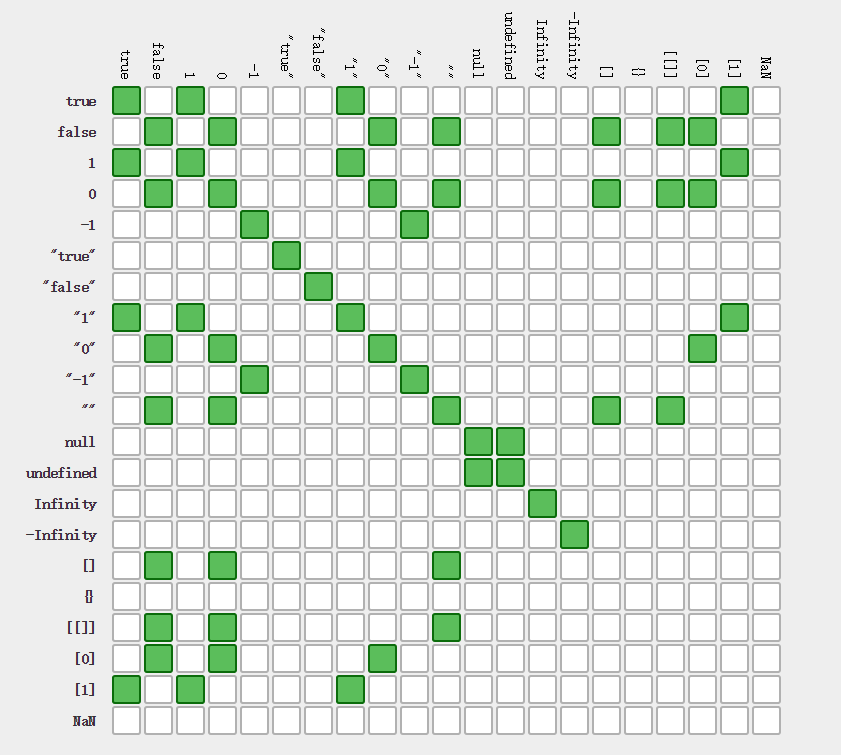
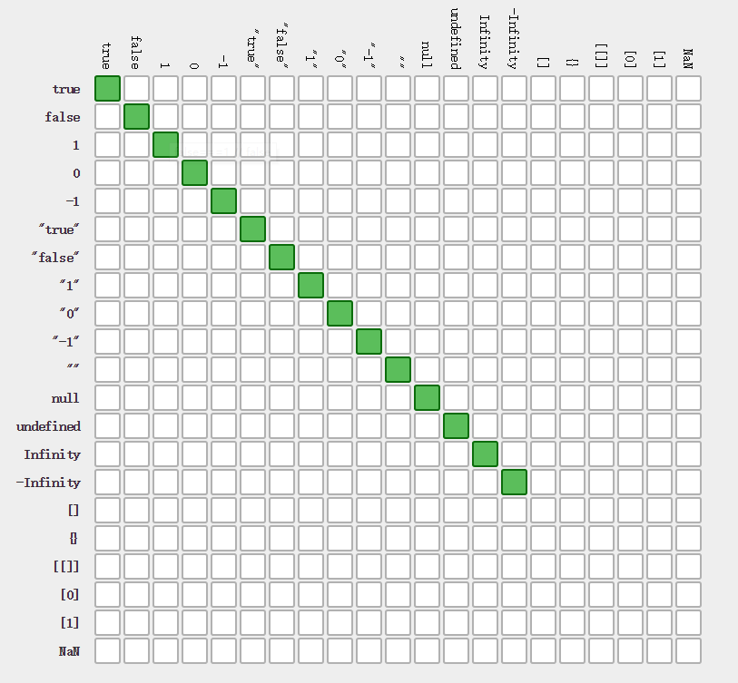

1. JavaScript 定义了几种数据类型? 哪些是原始类型?哪些是复杂类型?原始类型和复杂类型的区别是什么?
  七种数据类型：number,string,boolean,null,undefined,object,symbol
  原始类型：number,string,boolean,symbol
  复杂类型：object
  原始类型和复杂类型的区别：原始类型是最基本的数据类型，不能再细分了。复杂类型是多个原始类型的值的合成，可以看作是一个存放各种值的容器。

2. typeof和instanceof的作用和区别?
   typeof操作符返回一个字符串,指示未经计算的操作数的类型。可以判断原始类型，函数、undefined。其他情况都返回object。
    instanceof 运算符用来测试一个对象在其原型链中是否存在一个构造函数的 prototype 属性。

 ```javascript
  var o = {};
  var a = [];

o instanceof Array // false
a instanceof Array // true
 ```

3. 如何判断一个变量是否是数字、字符串、布尔、函数
   使用typeof
```javascript
 var a=1,b="string",c=true
 var function d(){}
 
 typeof a //number
 typeof b //string
 typeof c //boolean
 typeof d //function
```

4. `NaN`是什么? 有什么特别之处?
  `NaN`not a number，表示不是一个数字。NaN和任何值都不相等，包括自己

```
NaN == NaN //false
```

5. 如何把非数值转化为数值?
  Number()
  parseInt()
  parseFloat()
      1. 忽略字符串前面的空白字符，找到第一个非空白字符
      2. 如果第一个字符不是-或者数字返回NaN
      3. 如果是继续解析，直到非数值模式为止
      4. 0开头会当做八进制，0x开头会当做十六进制，但是可以指定第二个参数指定基数
```
parseInt('blue'); //NaN
parseInt('-23ABS'); // -23
parseInt('0xf1'); // 241
parseInt('101', 2); // 5
```

6. `==`与`===`有什么区别
`==` 相等，会自动转换类型比较。参考下表

`===` 严格相等，要数值和类型完全一样。参考下表


7. `break`与`continue`有什么区别
`break` 用于强制退出循环体，执行循环后面的语句。
`continue` 用于退出本次循环，执行下次循环。
例子对比
```javascript
for(var i = 1; i< 10; i++){
    if(i % 4 === 0){
        break;
    }

    console.log(i);
}
//结果：1 2 3

for(var i = 1; i< 10; i++){
    if(i % 4 === 0){
        continue;
    }

    console.log(i);
}
//结果:1 2 3 5 6 7 9
```
上面代码中break直接跳出循环，到i=4时就停止了循环，只输出了前面的1、2和3。contine在满足条件时执行下一次循环，所以满足条件的数字4和8并没有输出。

8. void 0 和 undefined在使用场景上有什么区别
undefined 并不是保留词（reserved word），在局部作用域中，可以被重写。
void 是不能被重写的。 void 运算符能对给定的表达式进行求值，然后返回 undefined，最短的是`void 0`，所以用`void 0` 来表示undefined。
使用void 0 来避免undefined被改写。

9. 以下代码的输出结果是?为什么?
```
console.log(1+1); //2,在两个操作数都是数字的时候，会做加法运算
console.log("2"+"4"); //24,两个参数都是字符串的情况下会把另外一个参数转换为字符串做字符串拼接
console.log(2+"4"); //24,有一个参数是字符串的情况下会把另外一个参数转换为字符串做字符串拼接
console.log(+"4");//4,只有一个字符串参数的时候会尝试将其转换为数字
```

10. 以下代码的输出结果是?
```
var a = 1;  
a+++a;  
typeof a+2;
```
输出: number2
`++`的优先级比`+`高，就是（a++）+a，a++等于2，再加1等于3。
typeof的优先级比`+` 高，就是（typeof a）+2，typeof a的结果为字符串number，字符串+数字，会将数字转换成字符串拼接，所以结果为number2。

11. 以下代码的输出结果是? 为什么
```
 var a = 1;
 var b = 3;
 console.log( a+++b );
```
结果：5
a+++b，相当于（a++）+b，a先自增为2，再和b相加，得出5.

12. 遍历数组，把数组里的打印数组每一项的平方
```
 var arr = [3,4,5]
```
代码
```javascript
var arr = [3,4,5]
for (var i=0; i<arr.length ;i++) {
  console.log(arr[i] * arr[i])
}
```
13. 遍历 JSON, 打印里面的值

```
var obj = {
 name: 'hunger', 
 sex: 'male', 
 age: 28 
}
for (var key in obj){
  console.log(obj[key])
}
```

14. 以下代码输出结果是? 为什么 （选做题目）

```
var a = 1, b = 2, c = 3;
var val = typeof a + b || c >0
console.log(val)  //number2
//val =（( (typeof a) + b) || c >0）,typeof优先级大于+，||在前面为真时就不看后面的了

var d = 5;
var data = d ==5 && console.log('bb')
console.log(data)  //bb
//data = （（d ==5） && console.log('bb') ）&&在都为真时返回后面的

var data2 = d = 0 || console.log('haha')
console.log(data2) //haha
//data2 = （d = （ 0 || console.log('haha') ）），0为false，所以返回后面的haha再赋值给d
 
var x = !!"Hello" + (!"world", !!"from here!!");
console.log(x) //2
// !!"Hello"为true， (!"world", !!"from here!!")逗号操作符会返回最后一个操作数的值 !!"from here!!"为true，所以就是true + true，加号运算符将左右都转换成数字1，结果为数字2
```
