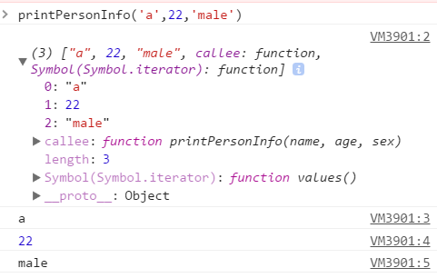

1. 函数声明和函数表达式有什么区别

函数声明不必一定要放在调用前面，会在作用域提升。
```
square(2)
function square(number) {
  return number * number;
}
```
上面的函数声明，会提升到作用域顶部，所以直接调用不会报错。
函数表达式必须放在调用的前面。
```
var square = function(number) {
  return number * number
};
var x = square(4)
```
函数表达式就不会提升到作用域顶部。

2. 什么是变量的声明前置？什么是函数的声明前置

在一个作用域下，var声明的变量和function声明的函数会前置。而函数的声明前置会将函数体也前置。
 - 变量声明前置举例：
```
console.log(a) //undefined
var a = 1
```
上面的变量声明中第一句并没有报错，a被赋值为undefined，相当于下面的代码:
```
var a
console.log(a)
a = 1
```
 - 函数声明前置会将整个函数（包括函数体）前置
```
square(2) //4
function square(number) {
  return number * number;
}
```
上面代码相当于
```
function square(number) {
  return number * number;
}
square(2)
```
会有结果返回，不会返回undefined

3. arguments 是什么

arguments 是一个类似数组的对象, 对应于传递给函数的参数。可以使用arguments对象在函数中引用函数的参数。它类似于数组，但除了长度之外没有任何数组属性。
```
  function printPersonInfo(name, age, sex){
    console.log(arguments[0]);
    console.log(arguments[1]);
    console.log(arguments[2]);
  }
  
  printPersonInfo('a',22,'male')
```


我们可以通过类似数组的方法访问到某一个参数，比如arguments[0]。

4. 函数的"重载"怎样实现

其他语言中重载就是在声明一个同名函数
```
int sum(int num1, int num2){
  return num1 + num2;
}

float sum(float num1, float num2){
  return num1 + num2;
}

sum(1, 2);
sum(1.5, 2.4);
```
JS中没有重载，因为同名函数会被后声明的函数覆盖。可以在函数体内部针对不同的参数来调用不同的逻辑。
```
  function printPeopleInfo(name, age, sex){
    if(name){
      console.log(name);
    }

    if(age){
      console.log(age);
    }

    if(sex){
      console.log(sex);
    }
  }


  printPeopleInfo('Byron', 26);
  printPeopleInfo('Byron', 26, 'male');
```

5. 立即执行函数表达式是什么？有什么作用

立即执行函数有多种写法(function(){})();, 或(function(){}()); ,或!function(){}();,或void function(){}();
作用如下：
一是不必为函数命名，避免了污染全局变量。
二是内部形成了一个单独的作用域，可以封装一些外部无法读取的私有变量。
```
(function(){
  var a  = 1;
})()
console.log(a); //undefined
```

6. 求n!，用递归来实现

```javascript
function factorial(number){
  if (number < 0){
    console.log("请输入大于等于0的整数")
    return
  }else if (number === 1 || number === 0){
    return 1
  }else{
    return number * factorial(number -1)
  }
}
```

7. 以下代码输出什么？

```
	function getInfo(name, age, sex){
		console.log('name:',name);
		console.log('age:', age);
		console.log('sex:', sex);
		console.log(arguments);
		arguments[0] = 'valley';
		console.log('name', name);
	}

    getInfo('饥人谷', 2, '男'); 
    getInfo('小谷', 3);
    getInfo('男');

```
输出：
```
name: 饥人谷
age: 2
sex: 男
["饥人谷", 2, "男"]
name valley

name: 小谷
age: 3
sex: undefined
["小谷", 3]
name valley

name: 男
age: underfind
sex: underfind
["男"] 
name valley
```

8. 写一个函数，返回参数的平方和？

```
   function sumOfSquares(){
       var sum=0;
       for (var i=0; i<arguments.length; i++){
         sum += arguments[i] * arguments[i]
       }
       return sum
   }
   var result = sumOfSquares(2,3,4)
   var result2 = sumOfSquares(1,3)
   console.log(result)  //29
   console.log(result2)  //10
```

9. 如下代码的输出？为什么

```
	console.log(a);
	var a = 1;
	console.log(b);
```
输出：
```
undefined
Uncaught ReferenceError: b is not defined
```

代码相当于：
```
var a
console.log(a);
a = 1;
console.log(b);
```
a初始值为undefined，而b并没有被声明过。

10. 如下代码的输出？为什么

```javascript
sayName('world');
sayAge(10);
function sayName(name){
  console.log('hello ', name);
}
var sayAge = function(age){
  console.log(age);
};
```
输出：
```
hello world
Uncaught TypeError: sayAge is not a function
```
函数声明可以将函数体一起提升到作用域的上面。
函数表达式必须先声明在使用，只提升了sayAge这个变量，并不会将函数体也提升。

11. 如下代码输出什么? 写出作用域链查找过程伪代码

```
var x = 10
bar() 
function foo() {
  console.log(x)
}
function bar(){
  var x = 30
  foo()
}
```
输出：
```
10
```
作用域链伪代码
```
1.
globalContext = {
  AO:{
    x:10
    foo: function
    bar: function
  },
  Scope:{null}
}
foo.[[scope]] = globalContext.AO
bar.[[scope]] = globalContext.AO
2.
barContext = {
  AO:{
    x: 30
  },
  Scope:{
    globalContext.AO
  }
}
3.
fooContext= {
  AO:{}
  Scope:globalContext.AO
}
```

14. 以下代码输出什么？ 写出作用域链查找过程伪代码

```
var a = 1;

function fn(){
  console.log(a)
  var a = 5
  console.log(a)
  a++
  var a
  fn3()
  fn2()
  console.log(a)

  function fn2(){
    console.log(a)
    a = 20
  }
}

function fn3(){
  console.log(a)
  a = 200
}

fn()
console.log(a)
```

输出：

```
undefined
5
1
6 
20
200
```
```
1.
globalContext ={
  AO:{
    a: 1，经过fn3变成：a:200
    fn: function
    fn3: function
  }
  Scope: null
}
fn.[[Scope]] = globalContext.AO
fn3.[[Scope]] = globalContext.AO
2.
fnContext = {
  AO:{
    初始a:undefined 下一步：a:5,再下一步：a：6;fn2后变成：a:20
    fn2:function
  }
  Scope:globalContext.AO
}
fn2.[[Scope]] = fnContext.AO
3.
fn3Context ={
  AO:{}
  Scope:globalContext.AO
}
4.
fn2Context = {
  AO: {},
  Scope:fnContext.AO
}
```